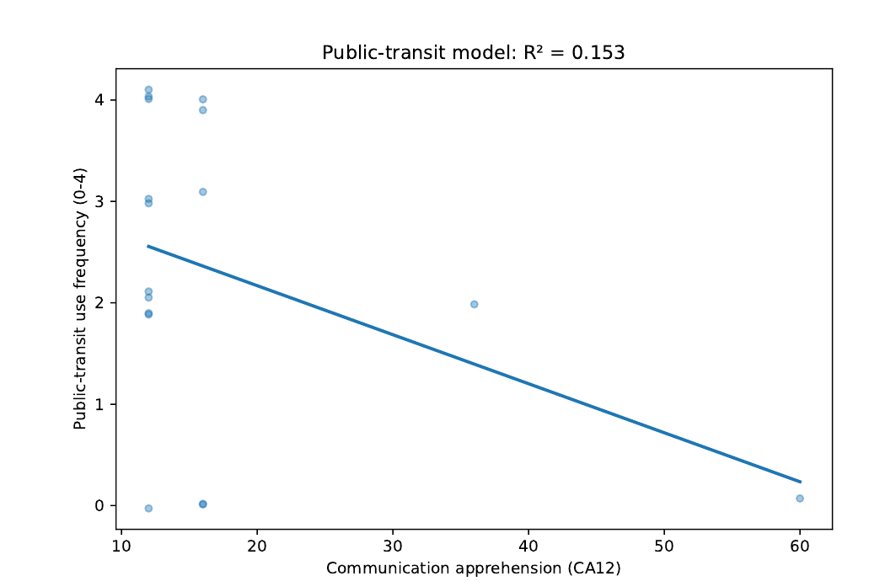
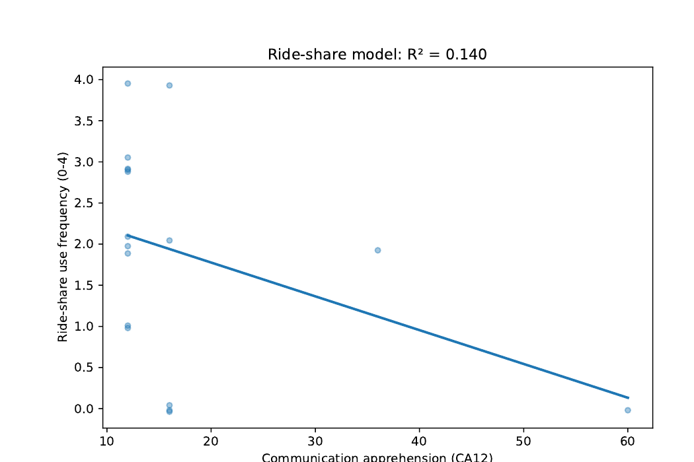
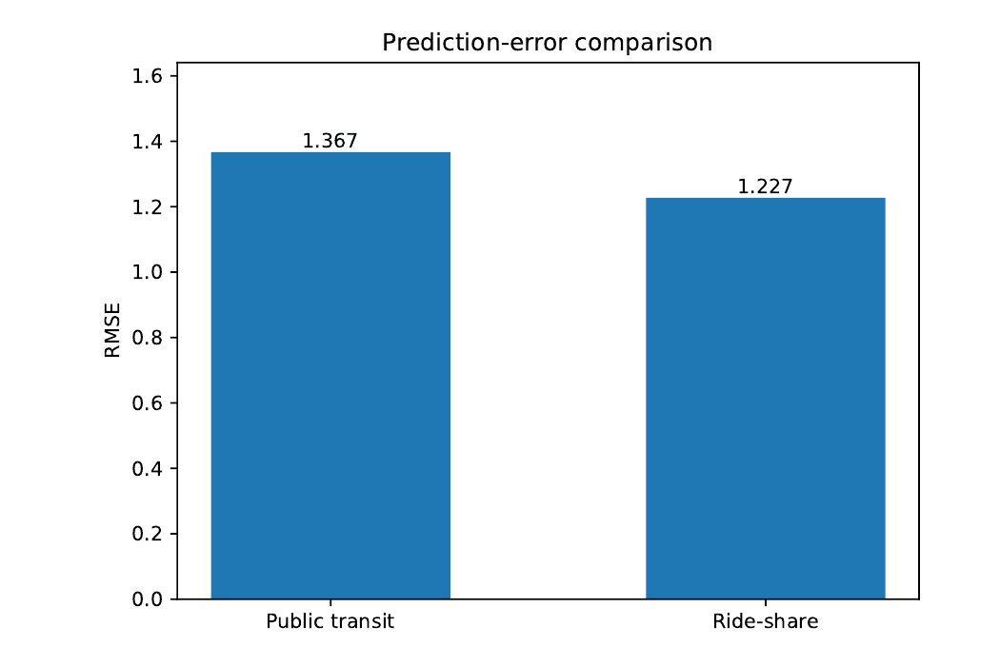
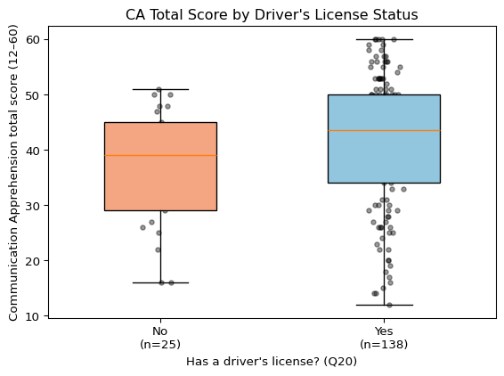
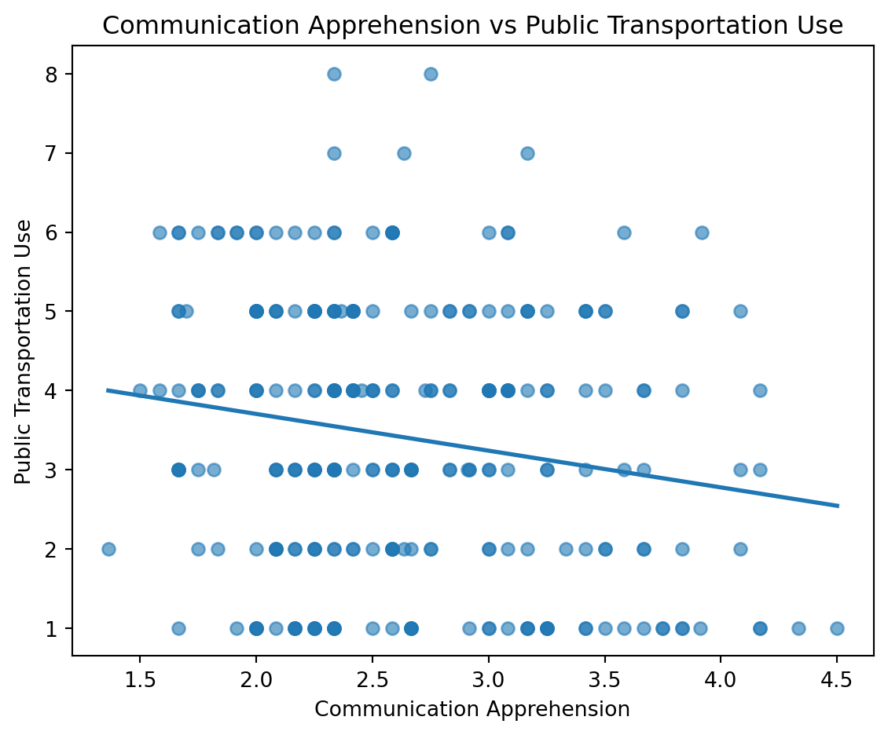
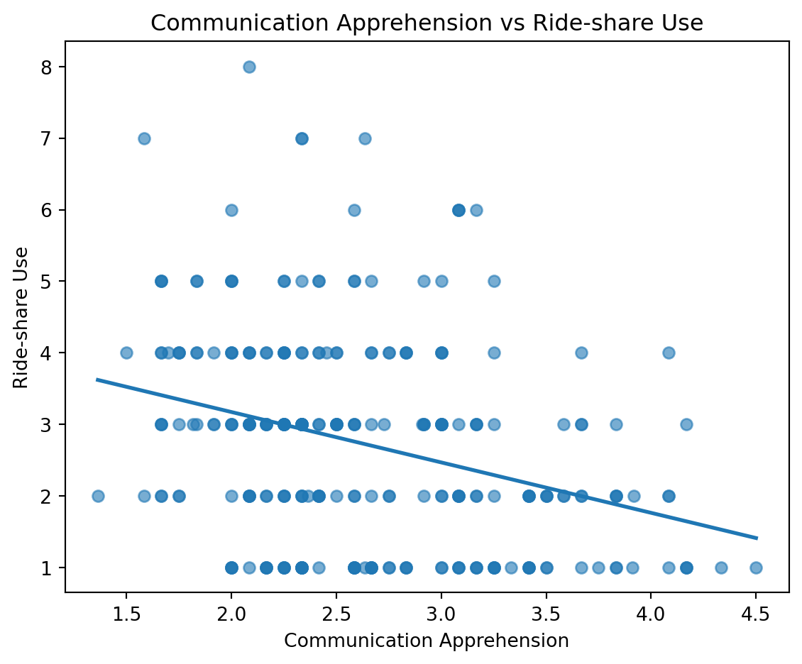
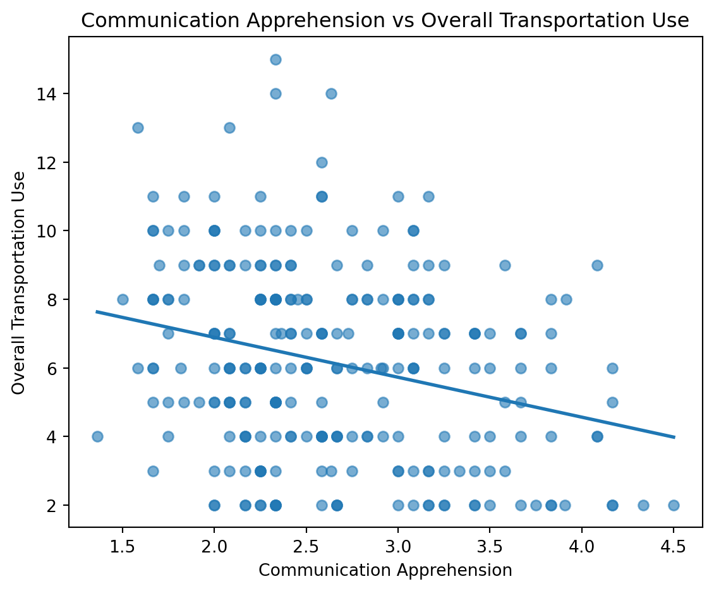
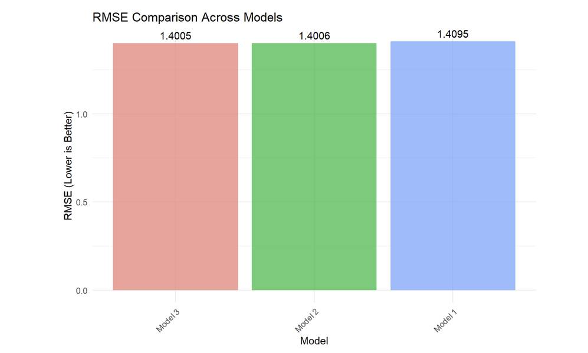
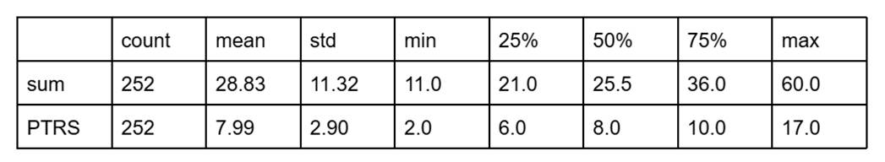
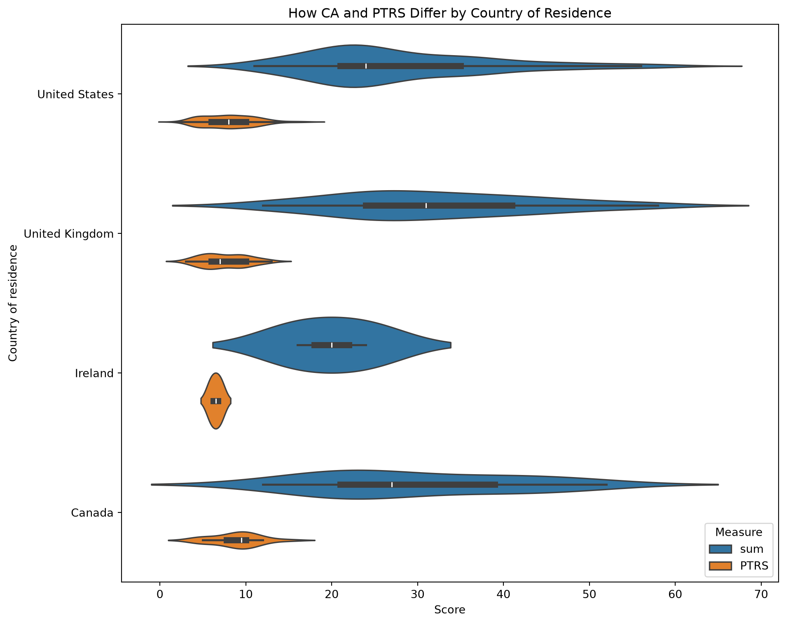

```{r setup, include=FALSE}
knitr::opts_chunk$set(echo = FALSE, warning = FALSE, message = FALSE)
```

# 1. Introduction and Literature Review

This manuscript is our submission for the summer semester project for Psych 755 at UW--Madison. In this project, we demonstrate usage of the following tools: Python (pandas, NumPy, SciPy, and statsmodels) for data cleaning and statistical modeling, Quarto/Jupyter notebooks for literate, reproducible research reporting, Matplotlib and Seaborn for data visualization, and Git/GitHub for version control and reproducibility across a five-person team.

Our substantive topic is communication apprehension (CA) --- the fear or anxiety a person feels, whether real or anticipated, associated with communicating with others (McCroskey, 1982). McCroskey introduced the Personal Report of Communication Apprehension (PRCA) as a self-report instrument for measuring this construct, and the 24-item revision (PRCA-24) remains the field's standard measure (McCroskey, 1982; see also James C. McCroskey's measurement page, jamescmccroskey.com/measures/prca24.htm). Our survey used 12 of the original items --- six tapping apprehension about group discussions (Q1--Q6) and six tapping apprehension in dyadic, interpersonal conversations (Q13--Q18) --- each answered on a five-point agreement scale.

This manuscript brings together five independently written research memos, each produced by one team member using the shared survey data (PRCAQualtricsExport_FileC.csv) and, where relevant, the linked Prolific recruitment records (PRCAProlificExport_FileA.csv and FileB.csv). Each subsection of the Results below reports that member's own research question, method, and findings as documented in their memo.

## 1.1 Research Questions

**RQ1 (Chao).** Which transportation outcome does communication apprehension predict more accurately --- public-transit use or ride-share use --- as judged by root mean squared error (RMSE)?

**RQ2 (Jiangran).** Does holding a driver's license (Q20) predict communication apprehension?

**RQ3 (Peiqi).** What visual strategy best illustrates the relationship between communication apprehension and transportation use?

**RQ4 (Yuhao).** Among a simple regression on total CA, a multiple regression on the two CA subscales, and a model that adds their interaction, which model gives the lowest RMSE for predicting public-transportation use frequency?

**RQ5 (Jingyi).** How do communication apprehension and public-transportation/ride-share use differ by country of residence?

# 2. Data and Methods

## 2.1 Data sources

PRCAQualtricsExport_FileC.csv is the Qualtrics export of the PRCA-style survey: the 12 communication-apprehension items (Q1--Q6, Q13--Q18), transportation-frequency items (Q26 public-transit days per month, Q28 ride-share days per month) with matched "rides per typical day" follow-ups (Q27, Q29), driver's-license and car-access items (Q20, Q21), and two open-ended items. PRCAProlificExport_FileA.csv and FileB.csv are Prolific platform exports covering two recruitment batches, with demographic fields including country of residence. Several memos (Chao, Jiangran, Peiqi, Yuhao) worked directly from FileC; the Jingyi memo additionally concatenated FileA and FileB and merged the result with FileC by matching each respondent's typed Prolific ID (Q0) to their Prolific "Participant id," in order to bring country of residence into the analysis.

Each team member wrote and ran their own independent data-cleaning and scoring script in their memo. As a result, the specific recoding choices --- which items were treated as reverse-worded, whether the 12-item composite was formed by summing or averaging, and how missing data were handled --- vary somewhat from memo to memo, and are described within each memo's own subsection below rather than standardized across the manuscript. Reported sample sizes therefore also vary by memo (from N = 17 to N = 255), reflecting each author's own listwise-deletion and file-loading choices.

# 3. Results

## 3.1 RQ1 (Chao): Public transit vs. ride-share --- which does CA predict more accurately?

Method: Using PRCAQualtricsExport_FileC.csv (273 rows), the memo recoded the 12 PRCA items to a 1--5 scale, reverse-scored the positively worded items (Q2, Q4, Q6, Q14, Q16, Q17), and summed the group (Q1--Q6) and interpersonal (Q13--Q18) subscores into a 12-item composite, CA12. Public-transit (Q26) and ride-share (Q28) use were recoded to 0--4. Separate simple linear regressions were fit for each outcome on CA12, and the two models were compared by RMSE. The memo reports 17 respondents with complete CA12 scores.

| Variable       | N   | Mean   | SD     | Median | Min   | Max   |
|----------------|-----|--------|--------|--------|-------|-------|
| CA12           | 17  | 17.412 | 12.405 | 12.0   | 12.0  | 60.0  |
| CA_group       | 32  | 12.312 | 9.437  | 6.0    | 6.0   | 30.0  |
| CA_interpersonal | 28 | 9.214  | 7.104  | 6.0    | 6.0   | 30.0  |
| PT             | 271 | 2.133  | 1.460  | 2.0    | 0.0   | 4.0   |
| RS             | 271 | 1.506  | 1.241  | 1.0    | 0.0   | 4.0   |

: Descriptive statistics reported. {#tbl-chao-descriptive}

| Outcome      | N   | Intercept | CA12 slope | R²     | p      | RMSE   |
|--------------|-----|----------|------------|--------|--------|--------|
| Public transit | 17 | 3.1361   | −0.0484    | 0.1534 | 0.1200 | 1.3671 |
| Ride-share   | 17 | 2.5979   | −0.0411    | 0.1397 | 0.1395 | 1.2273 |

: Regression estimates and RMSE reported. {#tbl-chao-regression}

```{r}
#| label: fig-chao-pt
#| fig-cap: "Public-transit use as a function of CA12."
#| echo: false
# Note: This figure should be replaced with the actual image from media/image1.png
# The original image path is: media/image1.png

```

```{r}
#| label: fig-chao-rs
#| fig-cap: "Ride-share use as a function of CA12."
#| echo: false
# Note: This figure should be replaced with the actual image from media/image9.png
# The original image path is: media/image9.png

```

```{r}
#| label: fig-chao-rmse
#| fig-cap: "RMSE comparison for the public-transit and ride-share models."
#| echo: false
# Note: This figure should be replaced with the actual image from media/image10.png
# The original image path is: media/image10.png

```

Direct answer: Communication apprehension predicts ride-share use more accurately under the memo's RMSE criterion: the ride-share model has the lower RMSE (1.227 vs. 1.367 for public transit). Neither slope reached statistical significance (public transit: b = −0.048, R² = 0.153, p = .120; ride-share: b = −0.041, R² = 0.140, p = .139).

## 3.2 RQ2 (Jiangran): Does driver's-license status predict communication apprehension?

Method: Using the same 12 PRCA items from FileC, this memo reverse-scored Q1, Q3, Q5, Q13, Q15, and Q18 and summed all 12 items into a composite CA_total. Respondents missing any CA item or Q20 (driver's-license status) were excluded, leaving an analytic sample of N = 163 (138 "Yes," 25 "No"). Group means were compared with an independent-samples t-test, with Levene's test checking the equal-variance assumption.

| Q20 | n   | Mean   | SD     | Median |
|-----|-----|--------|--------|--------|
| No  | 25  | 37.32  | 10.57  | 39.0   |
| Yes | 138 | 41.43  | 12.12  | 43.5   |

: CA_total by driver's-license status. {#tbl-gu-license}

```{r}
#| label: fig-gu-license
#| fig-cap: "CA_total by driver's-license status."
#| echo: false
#| fig-width: 6
#| fig-height: 5
# Note: This figure should be replaced with the actual image from media/image7.png
# The original image path is: media/image7.png

```

Direct answer: Levene's test supported equal variances (F = 0.963, p = .328); an independent-samples t-test found the difference not statistically significant, t(161) = 1.587, p = .114, Cohen's d = 0.345, with the license-holder group trending toward slightly higher CA. The memo notes that this reverse-scoring scheme changed both the magnitude and the direction of the group difference relative to an unreversed composite it also considered (where the no-license group had trended higher, p = .069), and flags this as an open question about which items the PRCA key treats as reverse-worded.

## 3.3 RQ3 (Peiqi): What visual strategy best illustrates the CA--transportation relationship?

Method: This memo computed a mean communication-apprehension score across the 12 items (Q1--Q6, Q13--Q18) after reverse-coding Q2, Q4, Q6, Q14, Q16, and Q18, and combined the transportation frequency and rides-per-day items into three outcomes: public-transportation use (Q26+Q27), ride-share use (Q28+Q29), and overall transportation use (their sum). Three scatterplots, each with a fitted linear trend line, were produced to visualize the relationship between apprehension and each outcome.

```{r}
#| label: fig-li-public
#| fig-cap: "Communication apprehension vs. public-transportation use."
#| echo: false
# Note: This figure should be replaced with the actual image from media/image6.png
# The original image path is: media/image6.png

```

```{r}
#| label: fig-li-rideshare
#| fig-cap: "Communication apprehension vs. ride-share use."
#| echo: false
# Note: This figure should be replaced with the actual image from media/image2.png
# The original image path is: media/image2.png

```

```{r}
#| label: fig-li-overall
#| fig-cap: "Communication apprehension vs. overall transportation use."
#| echo: false
# Note: This figure should be replaced with the actual image from media/image4.png
# The original image path is: media/image4.png

```

Answer: The memo concludes that scatterplots with fitted linear trend lines are an effective visual strategy: the trend line makes the overall direction immediately visible while the scatter conveys the amount of variability in the data. Across all three outcomes the visualizations suggest weak negative associations between communication apprehension and transportation use, most evident for overall transportation use, though the memo is explicit that these conclusions rest on visual inspection rather than a formal statistical test, and suggests nonparametric methods such as Spearman's rank correlation as a next step.

## 3.4 RQ4 (Yuhao): Model comparison for predicting public-transit use

Method: Three nested models predicted public-transportation use frequency (PTRS): Model 1 uses total communication apprehension (CA12) alone; Model 2 uses the group (CA_group) and interpersonal (CA_interpersonal) subscales separately; Model 3 adds their interaction term. Of 255 participants, the memo reports 11 missing CA12 values, 5 missing CA_group, and 7 missing CA_interpersonal, leaving 244 complete cases (95.7%) used to fit and compare the three models by RMSE, with R² reported alongside.

| Variable                             | Mean   | SD     | Range |
|--------------------------------------|--------|--------|-------|
| Public-transportation frequency (PTRS) | 2.07   | 1.45   | 0--4  |
| Total CA (CA12)                      | 28.9   | 11.33  | 12--60 |
| Group CA (CA_group)                  | 14.61  | 6.00   | 6--30  |
| Interpersonal CA (CA_interpersonal)  | 14.3   | 5.79   | 6--30  |

: Descriptive statistics reported (N = 244 complete cases). {#tbl-wang-descriptive}

| Model                                       | RMSE    | R²     |
|---------------------------------------------|---------|--------|
| Model 3 (group + interpersonal + interaction) | 1.4005  | 0.0686 |
| Model 2 (group + interpersonal)             | 1.4006  | 0.0684 |
| Model 1 (CA12 only)                         | 1.4095  | 0.0566 |

: RMSE and R² comparison across the three models (sorted by RMSE). {#tbl-wang-rmse}

| Model | Predictor                 | Estimate | SE    | t     | p                   |
|-------|---------------------------|----------|-------|-------|---------------------|
| 1     | Intercept                 | 2.952    | 0.249 | 11.87 | 6.512e-26 ***       |
| 1     | CA12                      | −0.031   | 0.008 | −3.81 | 1.757e-04 ***       |
| 2     | Intercept                 | 2.941    | 0.248 | 11.87 | 6.879e-26 ***       |
| 2     | CA_group                  | −0.078   | 0.028 | −2.76 | 6.209e-03 **        |
| 2     | CA_interpersonal          | 0.019    | 0.029 | 0.64  | 5.258e-01           |
| 3     | Intercept                 | 2.826    | 0.624 | 4.53  | 9.354e-06 ***       |
| 3     | CA_group                  | −0.070   | 0.048 | −1.46 | 1.45e-01            |
| 3     | CA_interpersonal          | 0.027    | 0.050 | 0.53  | 5.935e-01           |
| 3     | CA_group × CA_interpersonal | 0.000   | 0.002 | −0.20 | 8.415e-01           |

: Regression coefficients for Models 1--3. Significance stars: * p < .05, ** p < .01, *** p < .001. {#tbl-wang-coefficients}

```{r}
#| label: fig-wang-rmse
#| fig-cap: "RMSE comparison across the three regression models. Lower RMSE indicates better predictive accuracy. (reproduced from Wang's memo)."
#| echo: false
# Note: This figure should be replaced with the actual image from media/image3.jpg
# The original image path is: media/image3.jpg

```

The memo notes that the figure it produced to visualize this comparison ("Figure 1: RMSE comparison across the three regression models") was generated to an external file not included among the shared project files, so it is not reproduced here; the underlying RMSE and R² values are reported in Tables 5 and 6 above exactly as the memo presents them.

Direct answer: Model 3 gives the lowest RMSE (1.4005) and is identified as the best-performing model, narrowly ahead of Model 2 (RMSE = 1.4006) and Model 1 (RMSE = 1.4095). The memo also notes that the improvement from Model 1 to Model 2 is small (ΔR² = 0.0118) and the improvement from Model 2 to Model 3 is negligible, and suggests that the simpler Model 1 may be preferable on grounds of parsimony despite not having the numerically lowest RMSE. Across all three models, R² remains in the 5--7% range, which the memo interprets as showing that communication apprehension alone explains only a small portion of the variance in public-transportation use.

## 3.5 RQ5 (Jingyi): Do CA and transportation use differ by country?

Method: This memo concatenated PRCAProlificExport_FileA.csv and FileB.csv and merged the result with PRCAQualtricsExport_FileC.csv by matching each respondent's typed Prolific ID (Q0) to their Prolific "Participant id." The 12 PRCA items were coded on a 1--5 agreement scale (Q1, Q3, Q5, Q13, Q15, Q18 coded directly; Q2, Q4, Q6, Q14, Q16, Q17 coded on the reverse scale) and summed into a total CA score ("sum"). Public-transit and ride-share frequency (Q26, Q28) were coded 1--5 and rides-per-day (Q27, Q29) 1--4; their total across both modes formed "PTRS." The memo visualized both measures by country of residence using violin plots (with an embedded box plot), first across all recruited countries and then restricted to the four countries with the largest samples (United States, United Kingdom, Ireland, Canada).

```{r}
#| label: fig-jingyi-descriptive
#| fig-cap: "Descriptive statistics reported in Jingyi's memo."
#| echo: false
# Note: This figure should be replaced with the actual image from media/image5.jpg
# The original image path is: media/image5.jpg

```

```{r}
#| label: fig-jingyi-country
#| fig-cap: "Communication apprehension (\"sum\") and combined transportation use (\"PTRS\") by country of residence, restricted to the four largest-sample countries."
#| echo: false
# Note: This figure should be replaced with the actual image from media/image8.png
# The original image path is: media/image8.png

```

Direct answer: The memo's stated conclusion is descriptive: "we can see from the plot in different countries, CA and PTRS have some differences." No formal statistical test (e.g., ANOVA) is reported in the memo to accompany this visual comparison.

# 4. Discussion and Suggestions for Next Steps

Read together, the five memos' own reported findings suggest a generally negative relationship between communication apprehension and use of transportation modes that involve interacting with strangers: Chao's memo finds ride-share use is predicted somewhat more accurately (lower RMSE) than public-transit use, and Peiqi's memo's scatterplots likewise show weak negative associations for both outcomes, most visible for overall transportation use. Yuhao's memo, working with a much larger complete-case sample, similarly finds a small but statistically significant negative association between CA12 and public-transit use, and shows that splitting CA into group and interpersonal subscales adds only marginal predictive value over the single composite. Jiangran's memo does not find a statistically significant relationship between driver's-license status and CA, though the point estimate trends toward license-holders reporting somewhat higher apprehension under that memo's reverse-scoring scheme. Jingyi's memo shows country-level differences descriptively in a violin plot but does not report a formal test of whether those differences are statistically reliable.

As noted in Section 2.1, each memo's analytic sample size and specific scoring choices (which items were reverse-coded, and whether the composite was a sum or a mean) differ from memo to memo, since each was produced independently. Readers comparing numbers across sections of this manuscript should keep that in mind; we have reported each memo's own numbers, tables, and figures without altering them.

Limitations noted within the individual memos include: reliance on visual inspection rather than formal tests for the transportation-use scatterplots (Peiqi); a small non-license subgroup limiting power for the license-status comparison (Jiangran, n = 25); uniformly low R² values (5--15%) across every regression model reported (Chao, Yuhao), indicating CA is at most a minor predictor of transportation behavior; and, for the country comparison (Jingyi), highly unbalanced country sample sizes with no accompanying significance test.

Suggested next steps raised across the memos include: examining the group and interpersonal CA subscales separately rather than only the combined total (Jiangran); connecting license status to actual transportation use in a follow-up regression or mediation model (Jiangran); applying Spearman's rank correlation or other nonparametric methods better suited to the ordinal transportation measures (Peiqi); testing alternative model specifications such as polynomial terms or transformations (Yuhao); and controlling for possible confounds such as age, car access (Q21), and urban vs. rural residence in a multivariate model (Jiangran).

# References

McCroskey, J. C. (1982). An introduction to rhetorical communication (4th ed.). Prentice-Hall.

McCroskey, J. C. (n.d.). PRCA-24 (Personal Report of Communication Apprehension). Retrieved from https://www.jamescmccroskey.com/measures/prca24.htm
