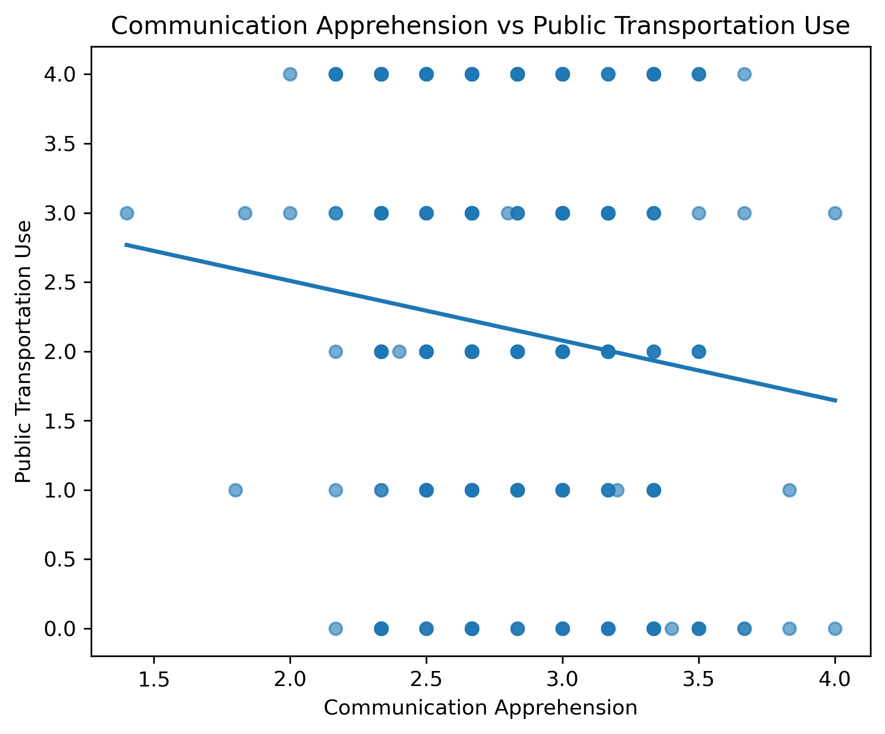
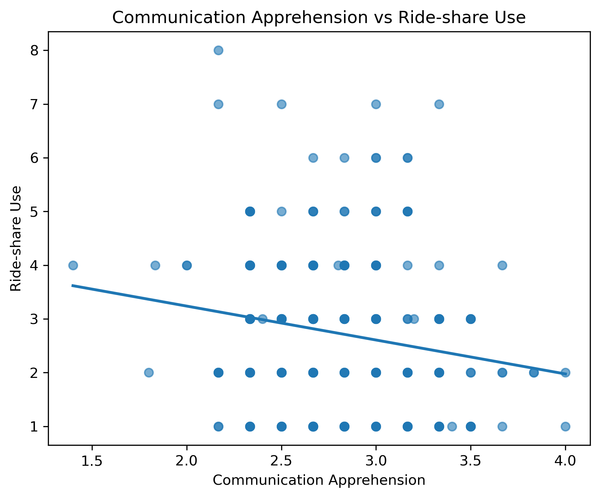
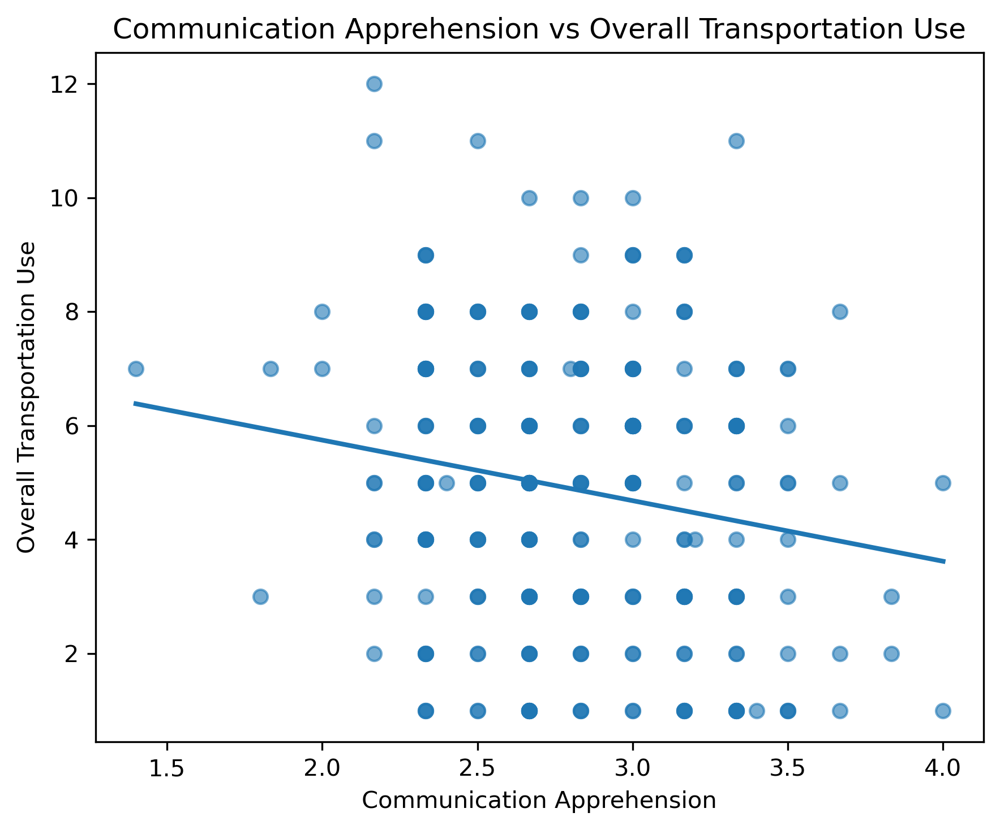

**Research Question:** What visual strategy best illustrates the relationship between communication apprehension and transportation use?

## Answer, Response, + Summary of Results

To explore the relationship between communication apprehension and transportation behavior, I created three scatterplots with fitted linear trend lines. Communication apprehension was calculated as the average score across twelve questionnaire items (Q1–Q6 and Q13–Q18) after reverse-coding the negatively worded items. Three transportation outcomes were examined: (1) Public transportation use, (2) Ride-share use, (3) Overall transportation use (public transportation use + ride-share use).

### Figure 1. Communication Apprehension vs. Public Transportation Use

{fig-align="center" width="70%"}

The scatterplot displays the relationship between communication apprehension and public transportation use. A fitted linear trend line summarizes the overall pattern in the data.

------------------------------------------------------------------------

### Figure 2. Communication Apprehension vs. Ride-share Use

{fig-align="center" width="70%"}

The scatterplot suggests a weak negative relationship between communication apprehension and ride-share use. The fitted regression line slopes slightly downward, indicating that participants with higher communication apprehension tended to report somewhat lower ride-share use.

------------------------------------------------------------------------

### Figure 3. Communication Apprehension vs. Overall Transportation Use

{fig-align="center" width="70%"}

Overall transportation use also exhibits a weak negative relationship with communication apprehension. The fitted trend line indicates that participants with higher communication apprehension generally reported lower overall transportation use.

### Overall Interpretation

Among the three visualizations, the scatterplots with fitted linear trend lines provide a simple and effective strategy for illustrating the relationship between communication apprehension and transportation use. The fitted line makes the overall direction of the relationship immediately visible, while the scatter of the individual observations conveys the amount of variability present in the data.

Across all three outcomes, the visualizations suggest weak negative associations between communication apprehension and transportation use. The relationship appears to be most evident when overall transportation use is considered, although none of the figures indicates a strong linear association.

## What questions or uncertainties remain?

These conclusions are based on visual inspection rather than formal statistical inference. The transportation measures are derived from ordinal survey responses, so the fitted linear trend lines should be interpreted as descriptive summaries rather than evidence of a causal relationship. Future analyses could quantify these relationships using nonparametric methods, such as Spearman's rank correlation, and investigate whether demographic characteristics or transportation accessibility influence these patterns.
